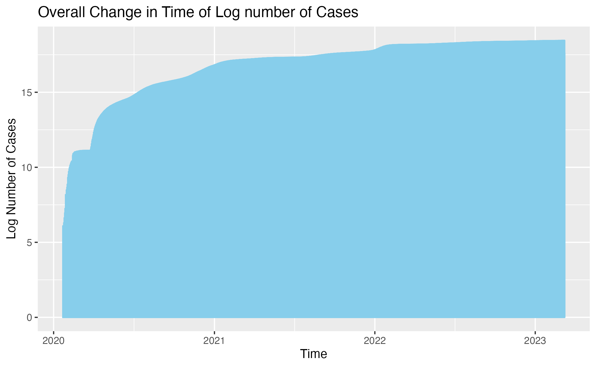
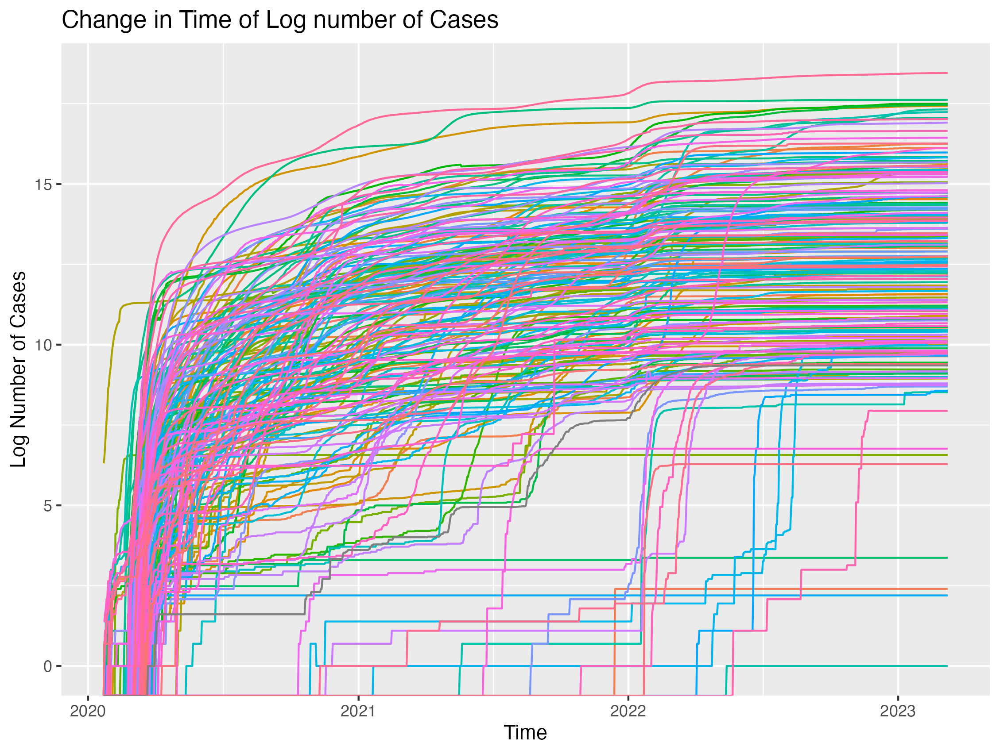
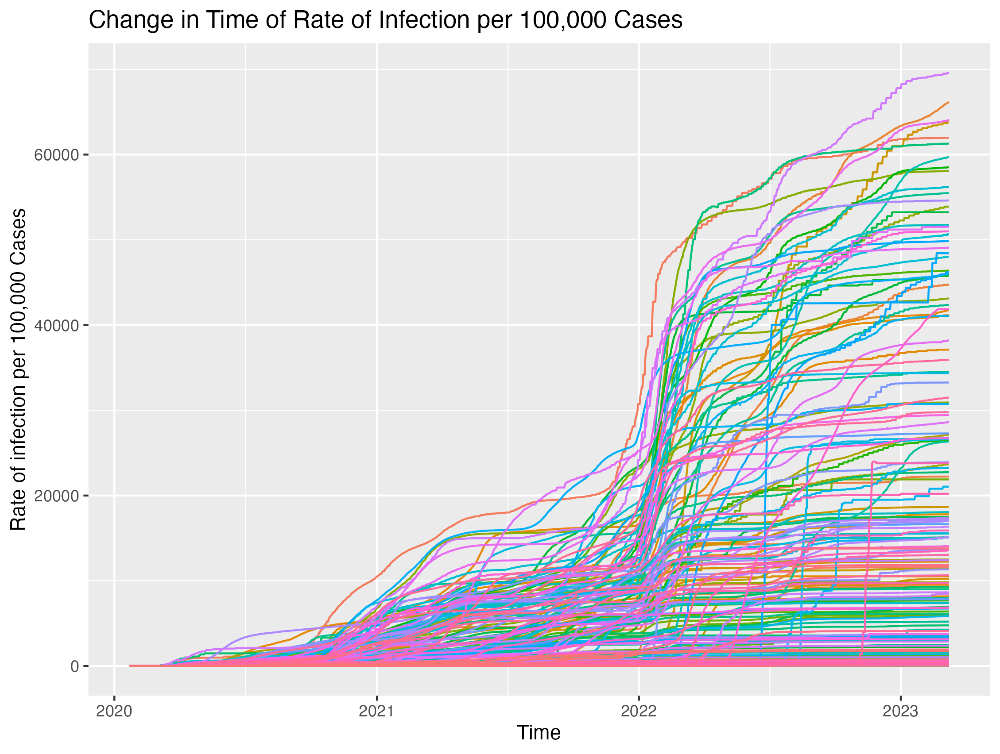

# COVID-19 Analysis Report
### -Using data from the Center for Systems Science and Engineering (CSSE) at Johns Hopkins University-


## Description

The goal of this project is to analyze the trends of COVID-19 cases between January 22, 2022, and March 9, 2023. The analysis focuses on understanding the overall changes in COVID-19 cases and variations across different countries during this period. The dataset in this analysis was obtained from the Center for Systems Science and Engineering (CSSE) at Johns Hopkins University (https://github.com/CSSEGISandData/COVID-19/tree/4360e50239b4eb6b22f3a1759323748f36752177/csse_covid_19_data).

Original datasets are UID_ISO_FIPS_LookUp_Table.csv and time_series_covid19_confirmed_global.csv, and the merged dataset was used for this analysis. The variables that are used in this analysis are as below: The final dataset contains variables below:

* **FIPS**: US only. Federal Information Processing Standards code that uniquely identifies counties within the USA.
* **UID**: Unique Identifier for each row entry.
* **ISO3**: Officially assigned country code identifiers.
* **FIPS**: Federal Information Processing Standards code that uniquely identifies counties within the USA.
* **Admin2**: County name. US only.
* **Province_State**: Province, state or dependency name.
* **Country_Region**: Country, region or sovereignty name. The names of locations included on the Website correspond with the official designations used by the U.S. Department of State.
* **Lat** and **Long**: Dot locations on the dashboard. All points (except for Australia) shown on the map are based on geographic centroids, and are not representative of a specific address, building or any location at a spatial scale finer than a province/state. Australian dots are located at the centroid of the largest city in each state.
* **Population**: Population data in the country.
* **time**: Date of data collection for each case record.
* **case**: The count of COVID-19 cases recorded.


## Organization of the repo

This repository is organized as follows:

* **/data** - Contains both the raw data and edited datasets used in the analysis.
* **/scripts** - Contains R script utilized for data processing and analysis.
* **/figs** - Contains figures (plot, etc) generated during the analysis or any visual outputs produced.
* **/documentation** - Contains instructional documents and a README HTML version.

The steps in creating the report is as follows:

1. Two Data sets were initially obtained from github repository (csse_covid_19_data) in R.
2. R was used to merge two dataset and clean data.
3. Graphs and tables were saved in the **/figs** folder. 


## Main findings from the analysis

The analysis indicates a general increase in COVID-19 cases over time.

The figure 1 below shows a significant rise in the log number of COVID-19 cases starting from early 2020, with a rapid increase observed until around 2011, and then gradually rising through 2023.

*Figure 1*

The figure 2 below illustrates the change in time of log number of cases. The majority of countries show similar increasing trends, with a rapid rise between 2020 and 2021, reflecting the initial spread of COVID-19 globally.There are a few countries that have been steadily increasing since 2021, indicating variations in the timing and intensity of COVID-19 cases among different regions.

*Figure 2*

The figure 3 presents a plot of change in time by country of rate of infection per 100,000 cases. From 2020 to 2021, the rate of infection per 100,000 cases exhibited a gradual increase, indicating a steady rise in the impact of COVID-19 during this period. Subsequently, there was a rapid rise from the middle of 2021 to 2022. Since then, the rate has continued to increase gradually. Notably, there are variations in the rate of infection between different countries. These variations could be due to various factors such as population density, public health measures, or healthcare infrastructure responses to the pandemic.

*Figure 3*

## Session info:

```
R version 4.3.1 (2023-06-16)
Platform: aarch64-apple-darwin20 (64-bit)
Running under: macOS Ventura 13.3

Matrix products: default

locale:
[1] en_US.UTF-8/en_US.UTF-8/en_US.UTF-8/C/en_US.UTF-8/en_US.UTF-8

attached base packages:
[1] stats     graphics  grDevices utils     datasets  methods   base     

other attached packages:
 [1] lubridate_1.9.3 forcats_1.0.0   stringr_1.5.0   dplyr_1.1.3     purrr_1.0.2     readr_2.1.4    
 [7] tidyr_1.3.0     tibble_3.2.1    tidyverse_2.0.0 ggplot2_3.4.4  

loaded via a namespace (and not attached):
 [1] gtable_0.3.4      compiler_4.3.1    tidyselect_1.2.0  textshaping_0.3.7 systemfonts_1.0.5
 [6] scales_1.2.1      yaml_2.3.7        fastmap_1.1.1     R6_2.5.1          labeling_0.4.3   
[11] generics_0.1.3    knitr_1.45        munsell_0.5.0     pillar_1.9.0      tzdb_0.4.0       
[16] rlang_1.1.1       utf8_1.2.4        stringi_1.7.12    xfun_0.41         timechange_0.2.0 
[21] cli_3.6.1         withr_2.5.2       magrittr_2.0.3    digest_0.6.33     grid_4.3.1       
[26] rstudioapi_0.15.0 hms_1.1.3         lifecycle_1.0.3   vctrs_0.6.4       evaluate_0.23    
[31] glue_1.7.0        farver_2.1.1      ragg_1.2.6        fansi_1.0.5       colorspace_2.1-0 
[36] rmarkdown_2.25    tools_4.3.1       pkgconfig_2.0.3   htmltools_0.5.7  
```


