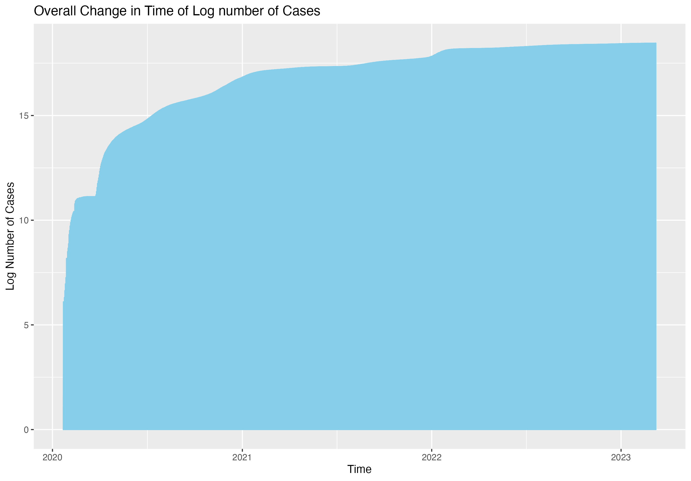

# COVID-19 Analysis Report
### -Using data from the Center for Systems Science and Engineering (CSSE) at Johns Hopkins University-
#### Modern Workflows in Data Science: Assignment 1

<<<<<<< HEAD
=======
## Description

The goal of this project is to analyze the trends of COVID-19 cases between January 22, 2022, and March 9, 2023. The analysis focuses on understanding the overall changes in COVID-19 cases and variations across different countries during this period. The dataset in this analysis was obtained from the Center for Systems Science and Engineering (CSSE) at Johns Hopkins University (https://github.com/CSSEGISandData/COVID-19/tree/4360e50239b4eb6b22f3a1759323748f36752177/csse_covid_19_data).

Original datasets are UID_ISO_FIPS_LookUp_Table.csv and time_series_covid19_confirmed_global.csv, and the merged dataset was used for this analysis. The variables that are used in this analysis are as below: The final dataset contains variables below:

* **FIPS**: US only. Federal Information Processing Standards code that uniquely identifies counties within the USA.
* **UID**: Unique Identifier for each row entry.
* **ISO3**: Officially assigned country code identifiers.
* **FIPS**: Federal Information Processing Standards code that uniquely identifies counties within the USA.
* **Admin2**: County name. US only.
* **Province_State**: Province, state or dependency name.
* **Country_Region**: Country, region or sovereignty name. The names of locations included on the Website correspond with the official designations used by the U.S. Department of State.
* **Lat** and **Long**: Dot locations on the dashboard. All points (except for Australia) shown on the map are based on geographic centroids, and are not representative of a specific address, building or any location at a spatial scale finer than a province/state. Australian dots are located at the centroid of the largest city in each state.
* **Population**: Population data in the country.
* **time**: Date of data collection for each case record.
* **case**: The count of COVID-19 cases recorded.

## Organization of the repo

This repository is organized as follows:

* **/data** - Contains both the raw data and edited datasets used in the analysis.
* **/scripts** - Contains R script utilized for data processing and analysis.
* **/tabs** - Contains tables generated during the analysis.
* **/figs** - Contains figures (plot, etc) generated during the analysis or any visual outputs produced.

The steps in creating the report is as follows:

1. Two Data sets were initially obtained from github repository (csse_covid_19_data) in R.
2. R was used to merge two dataset and clean data.
3. Graphs and tables were saved in the **/tabs** and **/figs** folders. 

## c. main findings where you include the three graphs and a sentence or two on their interpretation

*Figure 1*

*Figure 2*

*Figure 3*

## d. session info to help with reproducibility
